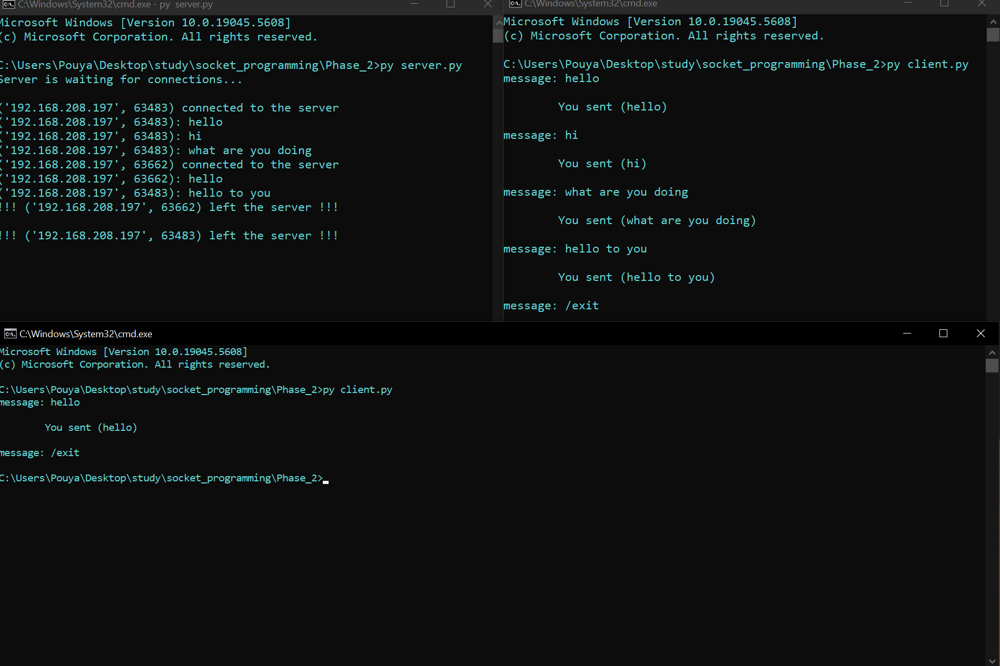

```markdown
# Multi-Client Chat Server with Ip nad port number

A simple multi-client chat server written in Python. It supports multiple clients simultaneously, allows each client to choose a nickname, and enables communication between clients. The server handles client connections using threads.

---

## 🚀 Features

- 🧑‍🤝‍🧑 Supports multiple concurrent clients
- 🧵 Thread-per-client architecture
- 🔁 Broadcast messages to all clients
- 🧼 Graceful disconnect using `/exit`
- 🔌 Built entirely with Python’s standard library

---

## 🛠️ Technologies Used

- Python 3.x
- `socket` — for TCP network communication
- `threading` — to handle multiple client sessions

---

## 📁 Folder Structure

```
multi-client-chat/
│
├── server.py               # Server logic (handles multiple clients)
├── client.py               # Client-side input/output logic
├── README.md               # Project documentation
└── images/                 # Screenshots (optional)
    ├── server-terminal.png
    └── clients-terminal.png
```

---

## ✅ Requirements

This project uses only built-in Python modules. No additional packages are needed.

---

## ▶️ How to Run



### 🟢 Start the Server

```bash
python server.py
```

### 🟠 Start One or More Clients (each in a new terminal)

```bash
python client.py
```

### 🔚 Exit the Chat
To disconnect from the chat, type:

```
/exit
```

---

## 🧠 How It Works

### 🖥️ Server Overview (`server.py`)

#### 1. Creating and Binding the Socket

```python
server_socket = socket.socket(socket.AF_INET, socket.SOCK_STREAM)
server_socket.bind((socket.gethostbyname(socket.gethostname()), 12345))
```

- Uses TCP (SOCK_STREAM) over IPv4 (AF_INET)
- Automatically binds to the local IP and port `12345`

#### 2. Accepting Clients and Creating Threads

```python
client_socket, client_address = server_socket.accept()
threading.Thread(target=handle_client, args=(client_socket, client_address)).start()
```

- Waits for client connections
- Spawns a new thread for each client using `handle_client()`

#### 3. Handling Client Messages

```python
def handle_client(client_socket, client_address):
    while True:
        message = client_socket.recv(1024).decode("utf-8")
        if message.lower() == "/exit":
            break
        print(f"{client_address}: {message}")
        client_socket.send(f"You sent ({message})".encode("utf-8"))
```

- Receives client input
- Echoes it back with a confirmation
- Disconnects gracefully on `/exit`

---

### 💻 Client Overview (`client.py`)

#### 1. Connecting to the Server

```python
client_socket = socket.socket(socket.AF_INET, socket.SOCK_STREAM)
client_socket.connect((socket.gethostbyname(socket.gethostname()), 12345))
```

- Connects to the server running on the same IP and port `12345`

#### 2. Chat Loop

```python
while True:
    message = input("message: ")
    client_socket.send(message.encode("utf-8"))
    if message.lower() == "/exit":
        break
    response = client_socket.recv(1024).decode("utf-8")
    print("\n\t", response, "\n", sep="")
```

- Sends message to the server
- Receives and displays echoed message
- Handles disconnection cleanly

---

## 🔍 Technical Highlights

- 🔁 TCP guarantees delivery and order of messages
- 🧵 Each client runs in its own thread on the server
- 🔤 Messages encoded/decoded in UTF-8
- 🧠 Easy to extend into full chatroom or GUI interface

---

## ⚠️ Limitations

- ❌ No broadcasting between clients
- 📜 No message logging or persistence
- 🛡️ No encryption or authentication
- 🔌 Server IP must be manually known by clients
- 🔄 Server restart required after crash

---

## 📌 Future Improvements

- [ ] Implement message broadcasting
- [ ] Add user nicknames
- [ ] Support GUI client (e.g., with PyQt)
- [ ] Add TLS/SSL encryption
- [ ] Display list of active clients

---

## 📄 License

This project is open-source and intended for educational use.  
No official license has been declared.

---